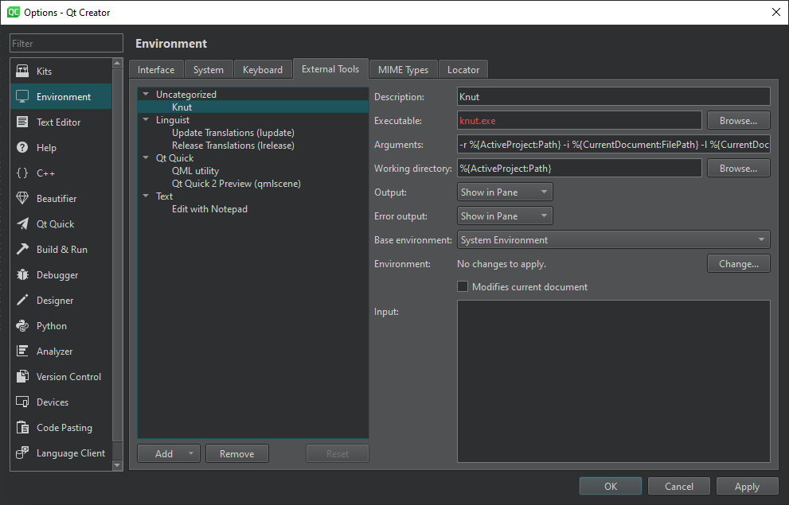

# Command Line Interface

## Using command line options

You can start knut by passing directly some options to the command line, using it in a headless way:
```
knut [option] [project]
```

The `project` is the directory containing the source code you want to work on. All available options are documented here:

| Options                 | Description                                              |
| ----------------------- | -------------------------------------------------------- |
| -r, --run `<file>`      | Runs given script `<file>` then exit                     |
| -t, --test `<file>`     | Tests given script `<file>` then exit                    |
| -i, --input `<file>`    | Opens document `<file>` on startup                       |
| -l, --line `<line>`     | Sets the line in the current file, if any                |
| -c, --column `<column>` | Sets the column in the current file, if any              |
| --gui-run               | Opens the run script dialog                              |
| --gui-settings          | Opens the settings dialog                                |
| --json-list             | Returns the list of all available scripts as a JSON file |
| --json-settings         | Returns the settings as a JSON file                      |

> Note: the json options are mainly used for integration with 3rd party, not meant to be used by user directly.

Without any options, knut will start the user interface.

## IDE integration

Using the command line interface, one can integrate with existing IDE.

### Qt Creator

To add knut to Qt Creator, go to the menu `Tools`>`External`>`Configure...`, create a new tool, and fill the different fields for a new tool.



Particularly:

- in Arguments, you can use different variables, like:
    - `--root %{ActiveProject:NativePath}`
    - `--input %{CurrentDocument:FilePath}`
    - `--line %{CurrentDocument:Row}`
    - `--column %{CurrentDocument:Column}`
- in Working directory: `%{ActiveProject:NativePath}`

For example, to open the knut user interface using the same project and same file as Qt Creator, you will pass in Arguments:
```
--input %{CurrentDocument:FilePath} --line %{CurrentDocument:Row} --column %{CurrentDocument:Column} %{ActiveProject:NativePath}
```
